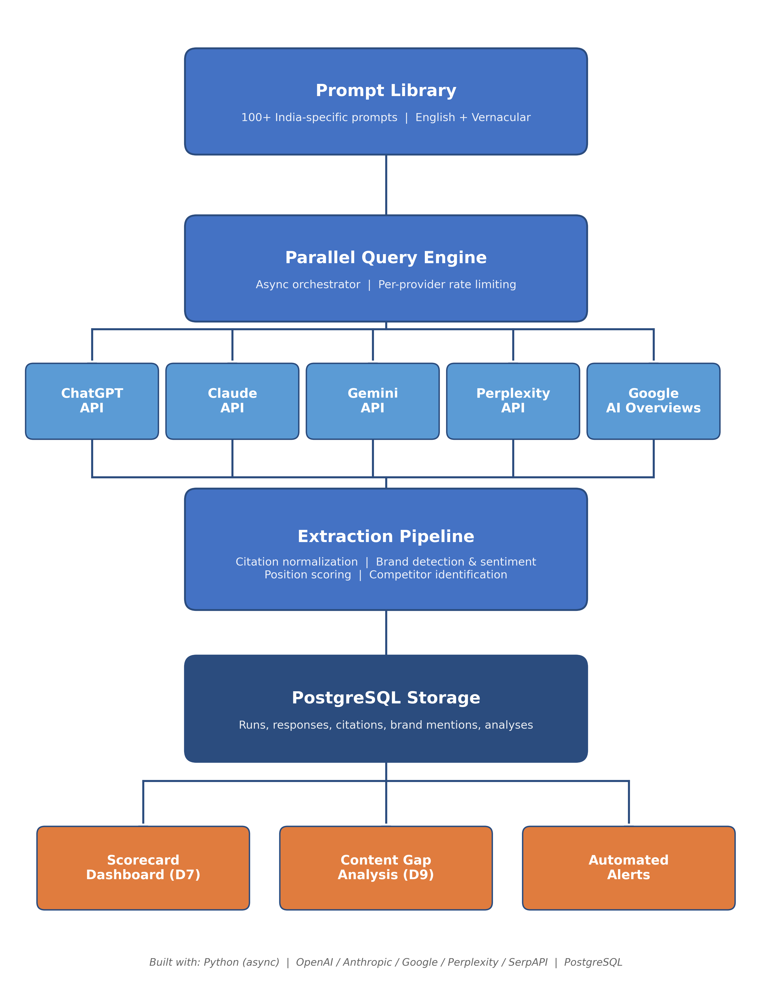

# Coca-Cola India: Generative Engine Optimization (GEO) Program

**Prepared by:** Cortivo
**Date:** February 2026
**Classification:** Confidential

---

## Index

1. [The Problem](#1-the-problem)
    - 1.1 AI Is Replacing Search in India
    - 1.2 What's at Stake
2. [Pilot Results: What We Found](#2-pilot-results-what-we-found)
    - 2.1 Visibility by Engine
    - 2.2 Prompt-Level Performance (Full Data)
    - 2.3 Critical Gaps Identified
    - 2.4 Competitive Intelligence
    - 2.5 Citation Source Analysis
3. [Deliverables](#3-deliverables)
    - D1: AI Retrieval Map
    - D2: Coke Content Technical Audit
    - D3: AI-Answer Page Templates + Fact Models
    - D4: Schema/JSON-LD + llms.txt Starter Pack
    - D5: 10-15 Co-Created AI-Readable Assets
    - D6: PDP Parity Checklist + Examples
    - D7: Top-100 Prompt KPI Dashboard
    - D8: Governance Playbook & FY26 Roadmap
    - D9: Content Gap Analysis & Briefs
4. [Capability Building & Training](#4-capability-building--training)
5. [Delivery Timeline](#5-delivery-timeline)
6. [Success Criteria](#6-success-criteria)
7. [Technical Architecture](#7-technical-architecture)
8. [Risks & Mitigations](#8-risks--mitigations)
9. [Immediate Next Steps](#9-immediate-next-steps)

---

## Executive Summary

When an Indian consumer asks ChatGPT "What's the best cold drink for summer in India?", Coca-Cola is mentioned only 11% of the time and recommended 0% of the time. AI engines instead suggest lassi, aam panna, nimbu pani, and competitor brands like Frooti and Paper Boat.

This is the new battleground. AI-powered search is replacing traditional search for millions of Indian consumers, and Coca-Cola's visibility in these AI responses is inconsistent, unmonitored, and in several high-intent categories, entirely absent.

Cortivo proposes to serve as Coca-Cola India's technology and intelligence partner for Generative Engine Optimization - building the custom tooling, running the diagnostics, and training internal teams and agency partners to measure, optimize, and sustain Coca-Cola's visibility across every major AI platform.

This proposal is grounded in a working pilot. We have already built and deployed a multi-engine AI citation tracker, run it against 10 India-specific prompts across ChatGPT, Gemini, and Perplexity, and produced the findings presented in this document. The data is real. The gaps are actionable. The system is ready to scale.

---

## 1. The Problem

### 1.1 AI Is Replacing Search in India

- **Google AI Overviews** launched in India in August 2024. AI Mode launched in India as the first international market in June 2025, with Hindi support added in September 2025.
- **25% of Google searches** now trigger an AI Overview globally. For consumer product queries, this number is higher.
- **87.4% of AI referral traffic** comes from ChatGPT alone (Conductor 2026 Benchmarks, 3.3B sessions).
- **AI-driven leads convert 2x higher** than traditional search sources.
- Consumer Staples/CPG receives **1.9% of all website traffic from AI referrals** - the second highest category after IT.

### 1.2 What's at Stake

Without systematic measurement, Coca-Cola India is flying blind in AI search. Key risks include:

- **Lost purchase intent** - high-intent queries like "best cold drink for summer" bypass Coca-Cola entirely
- **Uncontested competitor narratives** - Pepsi, Frooti, and emerging brands like Paper Boat and Campa Cola are being recommended without challenge
- **Negative health framing** - health-related queries surface critical content from advocacy sites that goes unmonitored and unaddressed
- **No India-specific content optimized for AI** - coca-cola.com has no pages designed to answer the exact questions Indian consumers are asking AI engines

---

## 2. Pilot Results: What We Found

To validate our approach and demonstrate technical capability, Cortivo built and deployed a working AI Citation Tracker. Below are the findings from a pilot study conducted on February 21, 2026.

**Pilot Parameters:**
- 10 India-specific prompts across 5 categories (purchase, product, comparison, health, sustainability)
- 3 AI engines: ChatGPT (GPT-5.2 Instant), Gemini (3 Flash), Perplexity (Sonar)
- 3 repeats per prompt per engine (90 total queries) to account for non-deterministic AI responses
- Automated brand extraction, sentiment analysis, citation normalization, and competitor tracking

### 2.1 Visibility by Engine

| Engine | Visibility | Share of Voice | Rec. Rate | Avg Position | Sentiment | Citation Rate |
|--------|-----------|----------------|-----------|-------------|-----------|---------------|
| ChatGPT (GPT-5.2) | 86.7% | 28% | **56.7%** | **2.7** | Positive (83%) | 66.7% |
| Gemini (3 Flash) | 86.7% | 24% | 40.0% | 3.0 | Positive (63%) | 100% |
| Perplexity (Sonar) | 83.3% | 42% | 23.3% | 3.6 | Negative (25%) | 100% |

**Metric Definitions:**

- **Visibility** - Percentage of responses where any Coca-Cola brand (Coca-Cola, Thums Up, Sprite, Maaza, etc.) is mentioned at all
- **Share of Voice (SOV)** - Coca-Cola brand mentions as a percentage of all brand mentions in the response (e.g., if 10 brands are mentioned and 3 are Coca-Cola brands, SOV = 30%)
- **Recommendation Rate** - Percentage of responses where the AI engine explicitly recommends or suggests a Coca-Cola product as a preferred choice
- **Average Position** - Where Coca-Cola brands appear in the response on average (1 = first brand mentioned, lower is better)
- **Sentiment** - Whether Coca-Cola brands are framed positively, neutrally, or negatively in the response, classified per mention
- **Citation Rate** - Percentage of responses where the AI engine provides source URLs or references to support its answer (not Coca-Cola-specific; reflects the engine's citation behavior)

**Key findings:**

1. **ChatGPT is Coca-Cola's strongest advocate.** It recommends Coca-Cola brands 57% of the time, places them at average position 2.7 (best among all competitors; Pepsi averages position 3.9), and frames them positively in 83% of mentions. This is the platform to protect.

2. **Perplexity is a reputational risk.** Despite the highest share of voice (42%), Perplexity has the lowest recommendation rate (23%) and the most negative sentiment (25% of mentions). It mentions Coca-Cola frequently - but often critically, especially on health-related prompts.

3. **Gemini always cites sources; ChatGPT often does not.** Gemini and Perplexity have 100% citation rates. ChatGPT only cites sources 67% of the time, frequently answering from training data alone. This means ChatGPT's recommendations are harder to influence through content optimization and more dependent on training data.

4. **Each engine cites entirely different sources.** Cross-engine citation overlap is approximately 0%, confirming industry research (Yext 2025: only 5% overlap across 6.8M citations). Optimizing for one engine does not transfer to another.

### 2.2 Prompt-Level Performance (Full Data)

| Prompt | Category | ChatGPT | | Gemini | | Perplexity | |
|--------|----------|---------|---|--------|---|------------|---|
| | | Visibility | Recommendation | Visibility | Recommendation | Visibility | Recommendation |
| Best cold drink for summer in India | Purchase | 33% | 0% | 0% | 0% | 0% | 0% |
| What are the ingredients in Coca-Cola? | Product | 100% | 0% | 100% | 0% | 100% | 0% |
| Is Thums Up better than Pepsi? | Comparison | 100% | 100% | 100% | 100% | 100% | 67% |
| Is Coke Zero safe for diabetics? | Health | 100% | 100% | 67% | 33% | 100% | 0% |
| Coca-Cola sustainability initiatives India | Sustainability | 100% | 100% | 100% | 100% | 100% | 100% |
| Healthiest soft drink options in India | Health | 33% | 33% | 100% | 33% | 100% | 0% |
| Coca-Cola vs Pepsi which is better | Comparison | 100% | 67% | 100% | 100% | 100% | 0% |
| Best mango drink brand in India | Purchase | 100% | 100% | 100% | 33% | 33% | 33% |
| How many calories in Thums Up? | Product | 100% | 0% | 100% | 0% | 100% | 33% |
| Is Coca-Cola packaging safe for kids? | Sustainability | 100% | 67% | 100% | 0% | 100% | 0% |

### 2.3 Critical Gaps Identified

**Gap 1: "Best cold drink for summer in India" - 11% visibility, 0% recommendation**

This is a high-volume, high-intent purchase query. All three engines recommend traditional Indian beverages (lassi, nimbu pani, aam panna, jaljeera) and competing brands (Frooti, Paper Boat). Coca-Cola products are mentioned in only 1 of 9 responses and never as a recommendation.

**Implication:** Coca-Cola India's web properties have no content optimized for this query. No page on coca-cola.com addresses "summer drinks in India." There is no FAQ schema, no answer-first content, and no structured data that AI engines can extract.

**Gap 2: "Healthiest soft drink options in India" - 78% visibility, 22% recommendation**

Health framing naturally disadvantages carbonated beverages. AI engines consistently recommend juices, coconut water, and buttermilk over soft drinks. When Coca-Cola brands are mentioned, it is often with qualifications about sugar content.

**Implication:** Coca-Cola's sugar-free and low-calorie portfolio (Coke Zero, Sprite Zero, Limca) is not being surfaced by AI engines in health contexts. Dedicated content positioning these products for health-conscious consumers is absent.

**Gap 3: "Best mango drink brand in India" - 78% visibility, 56% recommendation**

Maaza is visible but inconsistently recommended. Frooti and Slice appear ahead of Maaza on Gemini and Perplexity. Frooti has universally positive sentiment across all engines.

**Implication:** Maaza is losing the AI narrative in the mango category to Frooti. Content, citations, and structured data need to position Maaza as the category leader.

### 2.4 Competitive Intelligence

| Competitor Brand | Mentions | Avg Position | Sentiment | Recommended |
|-----------------|----------|-------------|-----------|-------------|
| **Pepsi** | 46 | 3.9 | Neutral | 15 |
| Frooti | 12 | 3.1 | Positive | 10 |
| Aam Panna | 7 | 4.7 | Positive | 5 |
| Paper Boat | 6 | 8.3 | Positive | 6 |
| Pepsi Black | 5 | 10.8 | Mixed | 2 |
| Raw Pressery | 4 | 6.0 | Positive | 4 |

- **Pepsi** is the dominant competitor by volume (46 mentions) but carries neutral sentiment. It is mentioned frequently but rarely enthusiastically recommended.
- **Frooti** punches above its weight - universally positive sentiment, strong recommendation rate, particularly in purchase-intent queries. It is winning the mango category narrative.
- **Paper Boat and Raw Pressery** are emerging in health-conscious and premium segments with 100% positive sentiment.
- **Traditional Indian drinks** (Aam Panna, Nimbu Pani, Lassi, Jaljeera, Coconut Water) collectively dominate brand-agnostic purchase queries, pushing all carbonated brands lower.

### 2.5 Citation Source Analysis

| Domain | Citations | Notes |
|--------|----------|-------|
| coca-cola.com | 33 | Coca-Cola's primary cited domain |
| youtube.com | 22 | Video content heavily cited by Gemini |
| coca-colacompany.com | 14 | Corporate site |
| en.wikipedia.org | 14 | Dominant on factual queries |
| timesofindia.indiatimes.com | 8 | Indian media |
| fda.gov | 7 | Health/safety queries |
| pmc.ncbi.nlm.nih.gov | 6 | Medical research citations |

**Coca-Cola's owned domains (coca-cola.com + coca-colacompany.com) account for 47 of 163 total citations (29%).** This is a strong authority signal - Coca-Cola's web properties are the single most cited source. However, no India-specific Coca-Cola domain (e.g., coca-cola.com/in) appears in citations, indicating an opportunity to strengthen India-localized content.

---

## 3. Deliverables

The engagement delivers nine artifacts across four workstreams, over a 10-week period. Each deliverable maps directly to the proposed scope.

### Deliverable 1: AI Retrieval Map (India-Specific)

**Workstream:** Diagnostics & AI Citation Mapping

A comprehensive diagnostic report mapping where each AI platform retrieves its answers from when responding to Coca-Cola India-related queries.

**What it covers:**
- Source mapping per engine: which corporate, social, video, PDP, third-party, and editorial sources each AI platform cites for Coca-Cola queries
- Domain-level and page-level citation breakdown (e.g., coca-cola.com/products vs coca-cola.com/sustainability)
- Social platform citation tracking: which platforms (YouTube, Wikipedia, Reddit, Quora, Times of India) appear in AI-generated responses and how frequently
- Competitor source comparison: where do engines pull Pepsi, Frooti, and Paper Boat information from, and how does that differ from Coca-Cola's citation sources
- Gap identification: authoritative domains that cite competitors but not Coca-Cola

**Format:** One-time diagnostic report delivered in Phase 1. Citation source data then feeds into the ongoing Top Prompt Scorecard (Deliverable 7) for continuous monitoring.

**Engines covered:** ChatGPT, Claude, Gemini, Perplexity, and Google AI Overviews.

---

### Deliverable 2: Coke Content Technical Audit

**Workstream:** Diagnostics & AI Citation Mapping

An automated audit of Coca-Cola India's web properties evaluating their readiness for AI engine citation.

**What it covers:**
- **Schema.org markup audit:** Presence and correctness of JSON-LD structured data - Product, FAQPage, NutritionInformation, Organization, BreadcrumbList - validated against Schema.org specifications
- **Structured data completeness:** Field-by-field scoring for each product page (does the Product schema include brand, manufacturer, nutrition, offers, ratings?)
- **llms.txt assessment:** Current state of llms.txt file (if any) and recommendations for content
- **AI bot crawlability:** robots.txt configuration for GPTBot, ClaudeBot, PerplexityBot, Google-Extended - are AI crawlers blocked, allowed, or unconfigured?
- **Page structure scoring:** Heading hierarchy, semantic HTML quality, answer-first content patterns, passage-level coherence (can a dense retriever extract a self-contained answer from each section?)
- **Social citation tracking:** Which Coca-Cola social properties (YouTube channels, official accounts) appear in AI-generated citations, and with what frequency per engine

**Scope:** coca-cola.co.in and related Coca-Cola web properties.

**Format:** Scored audit report with page-by-page findings and prioritized remediation recommendations.

---

### Deliverable 3: AI-Answer Page Templates + Fact Models

**Workstream:** AI-Readability Architecture

A template library and structured product knowledge base designed to make Coca-Cola India's content optimally extractable by AI engines.

**Part A - Answer-First Content Templates:**
- **Q&A blocks:** Structured question-answer pairs for the most common consumer queries - ingredients, calories, availability, price comparisons, health claims, sustainability facts
- **Fact tables:** Standardized nutrition tables in both HTML table and JSON-LD NutritionInformation format, designed for direct extraction by AI models
- **Entity signals:** Clear, disambiguated brand and product entity markup - ensuring AI engines correctly associate Thums Up, Maaza, Limca, and Kinley with Coca-Cola India
- **Template library:** Reusable HTML templates with guidelines that Coca-Cola's web team and agency partners can apply across all product pages and content

**Part B - Canonical Fact Models:**
- Structured knowledge base covering the **full Coca-Cola India portfolio**: Coca-Cola, Thums Up, Sprite, Fanta, Maaza, Minute Maid, Limca, Kinley, Schweppes, Coke Zero, and all variants
- Each product modeled with: brand, manufacturer, category, nutrition information (per serving), ingredients, pack sizes, availability, claims, and competitive positioning
- JSON-LD Product schema ready for deployment - designed to be the single authoritative structured source that AI engines extract from
- Covers ingredients, nutrition, packs, and claims as specified

**Format:** HTML template files + JSON data files + implementation guidelines document.

---

### Deliverable 4: Schema/JSON-LD + llms.txt Starter Pack

**Workstream:** AI-Readability Architecture

Production-ready structured data artifacts that Coca-Cola's web team can implement immediately.

**What it includes:**
- **Copy-paste JSON-LD snippets** for every major product page type: Product (with Offer, AggregateRating, NutritionInformation), Organization, FAQPage, BreadcrumbList, HowTo
- **Parameterized templates** for product variants and new launches - fill in product-specific values into a standard structure
- **llms.txt file** for coca-cola.co.in directing AI models to authoritative pages (product pages, nutrition information, sustainability reports, FAQs)
- **Validation tool** - a script that checks any Coca-Cola page for schema correctness, completeness, and compliance with the canonical fact models
- **Implementation guide** - step-by-step technical documentation for Coca-Cola's web team covering: where to place JSON-LD, how to validate, how to update for new products, and common pitfalls

**Format:** Code repository with ready-to-deploy snippets + validation script + technical documentation.

---

### Deliverable 5: 10-15 Co-Created AI-Readable Assets

**Workstream:** Capability Building

Working side-by-side with Coca-Cola's internal teams and content partners to convert 10-15 existing high-impact pages into AI-optimized assets.

**What it involves:**
- Coca-Cola's team selects 10-15 priority pages for conversion (product pages, FAQs, nutrition guides, or campaign landing pages)
- Cortivo works with the team to apply the templates from Deliverable 3 and the schema from Deliverable 4
- Each asset is converted to include: answer-first content structure, JSON-LD markup, FAQ schema where applicable, nutrition fact models, and entity signals
- Before/after comparison showing the structural improvements and expected AI-readability impact
- The process itself is the training - Coca-Cola's team learns by doing, building internal capability to produce AI-readable content independently going forward

**Format:** 10-15 converted pages (HTML/code) + before/after documentation.

---

### Deliverable 6: PDP Parity Checklist + Examples

**Workstream:** AI-Readability Architecture

A framework for ensuring Coca-Cola's product information is consistent across e-commerce and quick commerce platforms.

**What it includes:**
- **Parity checklist:** A structured methodology for comparing product detail pages across Amazon.in, BigBasket, Blinkit (Zomato), Zepto, and JioMart - covering product names, descriptions, images, nutrition info, claims alignment, variant availability, and pricing consistency
- **Example audits:** Worked examples showing the current state of 3-5 Coca-Cola products across platforms, with inconsistencies flagged and severity-scored
- **Remediation guidance:** For each inconsistency type, what the correct approach is and who owns the fix (brand team, e-commerce team, platform account manager)

**Note:** The scope of this deliverable - whether it remains a framework/checklist or expands into an automated monitoring tool - should be confirmed with Coca-Cola's e-commerce team based on their existing vendor relationships and platform access.

**Format:** Checklist document + example audit report + remediation guide.

---

### Deliverable 7: Top-100 Prompt KPI Dashboard

**Workstream:** Governance & Tracking

The central monitoring artifact - a live dashboard tracking Coca-Cola India's AI visibility across all major platforms.

**Prompt Library:**
- 100+ India-specific prompts from launch, covering: purchase intent, product information, health and safety, comparisons, occasions and usage, regional and cultural, sustainability and CSR, defensive/reputation, and e-commerce queries
- Prompts co-developed with Coca-Cola's team - Cortivo drafts the library based on research and pilot data; Coca-Cola contributes queries from their internal search data and brand priorities
- Prompt library maintained as a living artifact with additions for new product launches, seasonal campaigns, and emerging topics

**KPIs tracked per prompt, per engine:**
- **Visibility:** Whether Coca-Cola brands are mentioned (% of responses)
- **Position:** Where Coca-Cola brands appear in the response (1st mention, 2nd, etc.)
- **Sentiment:** Positive, neutral, negative, or mixed classification per brand mention
- **Recommendation rate:** Whether Coca-Cola is positioned as a recommended choice
- **Share of voice:** Coca-Cola mentions vs total brand mentions
- **Citation tracking:** Which Coca-Cola domains and pages are cited, at domain and page level - tracked per platform
- **Competitor share of voice:** Pepsi, Frooti, Campa Cola, Paper Boat, and emerging brands tracked continuously

**Platform coverage:** ChatGPT, Claude, Gemini, Perplexity, and Google AI Overviews.

**Features:**
- Delta tracking: week-over-week and month-over-month visibility changes
- Alerting on significant swings (>5% movement on any KPI)
- Weakest prompt identification with direct linkage to Content Gap Analysis (Deliverable 9)
- Export to CSV/PDF for stakeholder reporting
- Config-driven model selection: ability to test free-tier vs paid-tier models across providers to understand what most users actually see

**Format:** Live dashboard (visualization platform to be determined based on Coca-Cola's existing tooling preferences) + underlying PostgreSQL data layer.

**Open question for Coca-Cola:** Which Indian languages should the prompt library include? Hindi is the clear priority, but we would like to confirm interest in Tamil, Telugu, Bengali, Kannada, or other languages based on Coca-Cola India's regional priorities. Vernacular prompt tracking is a capability no existing GEO tool offers and represents a significant differentiation.

---

### Deliverable 8: Governance Playbook & FY26 Roadmap

**Workstream:** Governance & Tracking

The operational framework for sustained GEO performance beyond the initial 10-week engagement.

**Governance Playbook:**
- Monthly governance cadence: who reviews what metrics, when, and what actions are triggered
- Issue tracking and escalation process with RACI matrix (Responsible, Accountable, Consulted, Informed) across Coca-Cola's brand, digital, content, and agency teams
- Prompt library maintenance process: when and how to add prompts for new product launches, reformulations, seasonal campaigns, and crisis/reputation events
- Content update triggers: what visibility changes or competitive movements should trigger content updates, and who owns the response

**FY26 GEO Roadmap:**
- Quarterly milestones for scaling the GEO program through FY26
- Expansion path: additional engines, vernacular languages, e-commerce integration, advanced analytics
- KPI targets by quarter aligned with Coca-Cola India's brand and digital objectives

**Format:** Document (PDF/Notion) + RACI matrix spreadsheet.

---

### Deliverable 9: Content Gap Analysis & Briefs

**Workstream:** Diagnostics & AI Citation Mapping

The bridge between measurement and action - for every weak prompt identified in the Scorecard, a specific diagnosis and content recommendation.

**What it covers:**
- For each prompt where Coca-Cola visibility falls below threshold (e.g., <50% visibility or 0% recommendation rate), the system identifies:
  - What content currently exists on Coca-Cola's web properties for this query
  - What content is missing (no FAQ page, no product comparison, no health-focused content)
  - What competitors' content is being cited instead
  - What specific content should be created or updated, with recommended format (FAQ page, product page, blog post, video)
  - Which schema markup to include (FAQPage, Product, NutritionInformation)
- Each brief includes: target prompt, current visibility score, recommended content structure, suggested URL path, and schema requirements

**Example from pilot data:**
- Prompt: "Best cold drink for summer in India" - 11% visibility, 0% recommendation
- Diagnosis: No page on coca-cola.com addresses "summer drinks India"
- Brief: Create `/in/en/summer-drinks` page with FAQPage schema, listing Coca-Cola products (Thums Up, Sprite, Limca, Maaza) alongside traditional Indian beverages, with answer-first structure and NutritionInformation for each product
- Expected impact: measurable through re-running the same prompt after content publication

**Format:** Structured briefs per weak prompt, updated with each Scorecard run.

---

## 4. Capability Building & Training

Cortivo delivers all technical training and enablement directly to Coca-Cola India's internal teams and agency partners.

**Hands-on tool clinics:**
- Live demonstrations of the AI Citation Tracker, Content Audit Pipeline, and Scorecard Dashboard
- Conducted with Coca-Cola's marketing, digital, brand, and agency teams
- Teams learn to interpret the Scorecard, identify gaps, and prioritize content actions

**Co-creation sessions (Deliverable 5):**
- The process of converting 10-15 assets is itself the primary training mechanism
- Coca-Cola's team participates in applying templates, adding schema, and validating results
- By the end of the engagement, internal teams have hands-on experience producing AI-readable content

**Technical GEO Playbook (included in Deliverable 8):**
- Step-by-step documentation covering schema maintenance, llms.txt updates, AI-readable content publishing guidelines
- Ongoing self-audit procedures using Google Lighthouse and the validation tool from Deliverable 4
- Designed so Coca-Cola's web team can maintain and extend AI-readability independently

---

## 5. Delivery Timeline

### Phase 1: Diagnostics (Weeks 1-3)

| Deliverable | Description |
|-------------|------------|
| **D1** AI Retrieval Map | Full source mapping across 5 engines with 100+ prompts |
| **D2** Coke Content Technical Audit | Schema, structured data, crawlability, page structure audit of coca-cola.co.in |
| **D9** Content Gap Analysis (initial) | Gap identification for weakest prompts from first diagnostic run |
| **D7** Scorecard Dashboard (v1) | Initial dashboard with baseline KPIs from first full run |

**Milestone:** First full diagnostic run - 100+ prompts x 5 engines x 3 repeats. AI Retrieval Map and Content Technical Audit reports delivered. Baseline Scorecard live.

### Phase 2: Architecture (Weeks 4-6)

| Deliverable | Description |
|-------------|------------|
| **D3** AI-Answer Page Templates + Fact Models | Full India portfolio fact models + answer-first templates |
| **D4** Schema/JSON-LD + llms.txt Starter Pack | Code snippets, templates, validation tool, implementation guide |
| **D6** PDP Parity Checklist + Examples | Framework, example audits, remediation guidance |

**Milestone:** AI-Readability architecture complete. All templates, schema, and fact models delivered. PDP parity framework ready.

### Phase 3: Optimization & Training (Weeks 7-8)

| Deliverable | Description |
|-------------|------------|
| **D5** 10-15 Co-created AI-readable assets | Side-by-side conversion with Coca-Cola's team |
| **D9** Content Gap Analysis (expanded) | Updated briefs based on full prompt library |
| Training | Hands-on tool clinics for internal teams and agency partners |

**Milestone:** First optimization cycle complete. Re-measurement of weak prompts after content changes. Internal teams trained on all tools.

### Phase 4: Governance & Handoff (Weeks 9-10)

| Deliverable | Description |
|-------------|------------|
| **D7** Scorecard Dashboard (final) | Full dashboard with all engines, trends, delta tracking, alerts |
| **D8** Governance Playbook & FY26 Roadmap | Monthly cadence, RACI, prompt maintenance, quarterly roadmap |
| Handoff | Database migration to PostgreSQL, automated scheduling, documentation |

**Milestone:** Full system operational. Governance established. Teams trained. Ongoing monitoring live.

---

## 6. Success Criteria

The following success criteria reflect Coca-Cola India's stated objectives:

| Criteria | How We Measure It | Deliverable |
|----------|-------------------|-------------|
| Improved presence and positioning across priority prompts | Visibility score and average position trending upward in the Scorecard | D7, D9 |
| Increased citations of Coca-Cola domain/pages | Citation rate and domain-level citation tracking in the Scorecard | D1, D7 |
| Strong AI-readability structures adopted by internal teams and agencies | 10-15 assets converted, team trained, playbook delivered | D5, D4, D8 |
| Accurate, consistent brand narratives across AI answers | Sentiment scores stable/positive, competitor narratives monitored | D7, D9 |
| Clear playbook and operating model for scale in FY26 | Governance playbook, RACI, and FY26 roadmap delivered | D8 |

---

## 7. Technical Architecture

**Built with:** Python (async), OpenAI / Anthropic / Google / Perplexity / SerpAPI, PostgreSQL, configurable visualization layer. Config-driven model selection allows testing across free-tier and paid-tier models without code changes.

---

## 8. Risks & Mitigations

| Risk | Impact | Mitigation |
|------|--------|-----------|
| AI responses are non-deterministic | Same prompt produces different results each time | Statistical approach: 3+ repeats per prompt, majority voting, trend tracking over time rather than single-shot measurements |
| llms.txt adoption is unproven | Investment may not improve AI citations | Implement as low-cost hedge; focus primary effort on schema markup (proven 13x impact for FAQPage) and content structure |
| Indian language AI quality varies | Hindi/Tamil responses may be lower quality or mixed-language | Explicit testing and benchmarking; design prompts for both pure vernacular and Hinglish patterns |
| E-commerce platform access | PDP parity checking across Blinkit/Zepto requires platform cooperation | Begin with framework and manual audits; leverage Coca-Cola's existing vendor relationships for deeper access |
| Measurement attribution | Connecting AI visibility improvements to business outcomes is complex | Track AI referral traffic as a distinct GA4 channel; align with Coca-Cola's broader analytics stack |

---

## 9. Immediate Next Steps

1. **Confirm prompt library priorities** - Align on the initial 100+ prompts with Coca-Cola India's brand, marketing, and digital teams. Cortivo drafts the library; Coca-Cola contributes high-priority queries from internal search data.
2. **Confirm language priorities** - Which Indian languages should the program track beyond English? Hindi, Tamil, Telugu, and others based on Coca-Cola India's regional strategy.
3. **coca-cola.co.in access** - Provide crawl access for the Technical Content Audit (Deliverable 2).
4. **Identify co-creation pages** - Coca-Cola's team selects the 10-15 high-impact pages for Deliverable 5.
5. **Clarify PDP parity scope** - Confirm whether Deliverable 6 remains a framework/checklist or should include automated monitoring tooling.
6. **Stakeholder alignment** - Identify the monthly governance reviewers and GEO champions within Coca-Cola India for the RACI matrix.
7. **Kick off Phase 1** - Deploy the production Citation Tracker and begin the first full diagnostic run.

---

*This proposal is based on a working pilot deployed and tested on February 21, 2026. All data, findings, and performance metrics presented are from actual AI engine queries, not simulations or estimates. The pilot system processes 90 queries in under 3 minutes with parallel execution across all engines.*
